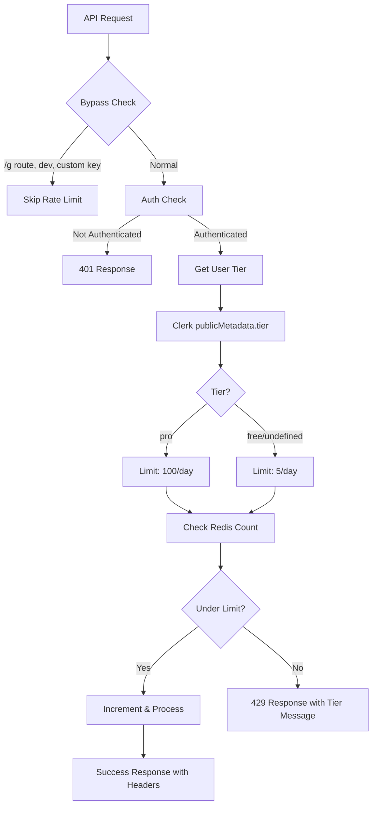

# Design Document: User Tier Rate Limiting

## Overview

Sistem tier rate limiting yang membedakan Free user (5 generate/day) dan Pro user (100 generate/day dengan FUP). Menggunakan Clerk publicMetadata untuk tier detection dan Redis untuk usage tracking. Desain ini meminimalkan perubahan pada existing code dengan menambahkan tier-aware logic ke fungsi `checkRateLimit`.

## Architecture



## Components and Interfaces

### 1. UserTier Type

```typescript
type UserTier = "free" | "pro"

interface TierConfig {
  limit: number
  name: string
  rateLimitMessage: string
}

const TIER_CONFIGS: Record<UserTier, TierConfig> = {
  free: {
    limit: 5,
    name: "Free",
    rateLimitMessage: "You have reached the maximum of 5 generations per day. Upgrade to Pro for 100 generations per day."
  },
  pro: {
    limit: 100,
    name: "Pro",
    rateLimitMessage: "You have reached the Fair Use Policy limit of 100 generations per day. Your limit will reset at midnight UTC."
  }
}
```

### 2. getUserTier Function

```typescript
interface ClerkUserMetadata {
  tier?: UserTier
}

async function getUserTier(userId: string): Promise<UserTier> {
  // Retrieve tier from Clerk publicMetadata
  // Default to "free" if not set or on error
}
```

### 3. Enhanced checkRateLimit Function

```typescript
interface RateLimitResult {
  allowed: boolean
  remaining: number
  resetTime: number
  tier: UserTier
  limit: number
}

async function checkRateLimit(
  userId: string, 
  tier: UserTier
): Promise<RateLimitResult>
```

### 4. Rate Limit Response Headers

```typescript
interface RateLimitHeaders {
  "X-RateLimit-Limit": string      // Tier limit (5 or 100)
  "X-RateLimit-Remaining": string  // Remaining requests
  "X-RateLimit-Reset": string      // UTC timestamp
  "X-RateLimit-Tier": string       // "free" or "pro"
}
```

## Data Models

### Redis Key Structure

```
ratelimit:user:{userId}:{YYYY-MM-DD}
```

Key format tetap sama, tidak perlu menyimpan tier di Redis karena tier diambil dari Clerk metadata setiap request. Ini memastikan perubahan tier langsung berlaku.

### Clerk publicMetadata Structure

```typescript
// User's publicMetadata in Clerk
{
  tier: "free" | "pro"  // Optional, defaults to "free"
}
```

### Rate Limit Error Response

```typescript
interface RateLimitErrorResponse {
  error: "Rate limit exceeded"
  message: string           // Tier-specific message
  tier: UserTier
  limit: number
  resetTime: number
}
```


## Correctness Properties

*A property is a characteristic or behavior that should hold true across all valid executions of a system—essentially, a formal statement about what the system should do. Properties serve as the bridge between human-readable specifications and machine-verifiable correctness guarantees.*

### Property 1: Tier Detection Correctness

*For any* user with Clerk publicMetadata, if tier is "pro" then getUserTier returns "pro", otherwise getUserTier returns "free" (including undefined, "free", or any other value).

**Validates: Requirements 1.1, 1.2, 1.3**

### Property 2: Rate Limit Enforcement Per Tier

*For any* user with tier T and current request count N, the request is allowed if and only if N < limit(T), where limit("free") = 5 and limit("pro") = 100.

**Validates: Requirements 2.1, 2.2, 3.1, 3.2**

### Property 3: Tier-Specific Error Messages

*For any* rate-limited user, the error message contains tier-appropriate content: "Upgrade to Pro" for free users, "Fair Use Policy" for pro users.

**Validates: Requirements 2.3, 3.3, 6.1, 6.2**

### Property 4: Response Headers Correctness

*For any* API response, the rate limit headers correctly reflect: X-RateLimit-Limit equals tier limit, X-RateLimit-Remaining equals limit minus count, X-RateLimit-Reset equals next UTC midnight timestamp, and X-RateLimit-Tier equals user's tier.

**Validates: Requirements 4.1, 4.2, 4.3, 4.4**

### Property 5: Bypass Logic Preservation

*For any* request that matches bypass conditions (/g route, development mode, or custom API key), the rate limiter does not check or modify Redis usage count.

**Validates: Requirements 5.1, 5.2, 5.3, 5.4**

### Property 6: Error Response Structure

*For any* rate limit error response (HTTP 429), the response body contains: error message, tier, limit, and resetTime fields.

**Validates: Requirements 6.3, 6.4**

## Error Handling

### Clerk Metadata Errors

- **Scenario**: Clerk API fails or returns invalid data
- **Handling**: Default to "free" tier, log warning
- **Rationale**: Fail-safe approach, users get service with lower limits rather than complete failure

### Redis Errors

- **Scenario**: Redis connection fails or times out
- **Handling**: Allow request (existing behavior), log error
- **Rationale**: Availability over strict rate limiting

### Invalid Tier Values

- **Scenario**: publicMetadata.tier contains unexpected value
- **Handling**: Treat as "free" tier
- **Rationale**: Only explicitly "pro" users get pro limits

## Testing Strategy

### Unit Tests

1. **getUserTier function**
   - Test with tier="pro" → returns "pro"
   - Test with tier="free" → returns "free"
   - Test with tier=undefined → returns "free"
   - Test with Clerk error → returns "free"

2. **checkRateLimit function**
   - Test free user under limit → allowed
   - Test free user at limit → rejected
   - Test pro user under limit → allowed
   - Test pro user at limit → rejected

3. **Response headers**
   - Verify all 4 headers present
   - Verify values match tier and count

4. **Error messages**
   - Verify free user message contains "Upgrade"
   - Verify pro user message contains "Fair Use Policy"

### Property-Based Tests

Property-based testing library: **fast-check** (TypeScript)

Each property test runs minimum 100 iterations.

1. **Property 1 Test**: Generate random metadata objects, verify tier detection logic
   - Tag: **Feature: user-tier-rate-limit, Property 1: Tier Detection Correctness**

2. **Property 2 Test**: Generate random (tier, count) pairs, verify allowed/rejected matches formula
   - Tag: **Feature: user-tier-rate-limit, Property 2: Rate Limit Enforcement Per Tier**

3. **Property 3 Test**: Generate rate limit scenarios per tier, verify message content
   - Tag: **Feature: user-tier-rate-limit, Property 3: Tier-Specific Error Messages**

4. **Property 4 Test**: Generate responses with various counts/tiers, verify header calculations
   - Tag: **Feature: user-tier-rate-limit, Property 4: Response Headers Correctness**

5. **Property 5 Test**: Generate requests with bypass conditions, verify no Redis interaction
   - Tag: **Feature: user-tier-rate-limit, Property 5: Bypass Logic Preservation**

6. **Property 6 Test**: Generate 429 responses, verify required fields present
   - Tag: **Feature: user-tier-rate-limit, Property 6: Error Response Structure**

### Integration Tests

1. End-to-end test with mocked Clerk returning pro tier
2. End-to-end test with mocked Clerk returning free tier
3. Test tier change mid-day (verify new limit applies immediately)
